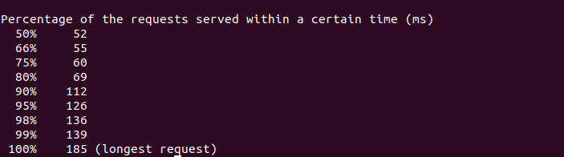

# 简单web程序

## 概述
开发简单 web 服务程序 cloudgo，了解 web 服务器工作原理。

### 任务目标

1. 熟悉 go 服务器工作原理
2. 基于现有 web 库，编写一个简单 web 应用类似 cloudgo。
3. 使用 curl 工具访问 web 程序
4. 对 web 执行压力测试

### 相关知识

课件：http://blog.csdn.net/pmlpml/article/details/78404838

## 任务要求

### 基本要求

1. 编程 web 服务程序 类似 cloudgo 应用。
2. 使用 curl 测试，将测试结果写入 README.md。
3. 使用 ab 测试，将测试结果写入 README.md。并解释重要参数。

## 测试

### curl测试

根据程序的需要，如图所示安装三个轻量级的组件，分别是`gorilla/mux`、`codegangsta/negroni`和`unrolled/render`。

为了使用`curl`测试，使用命令`sudo apt install curl`安装curl。

在终端对应的路径输入指令`go run mian.go -p9090`，建立服务器端口并进行监听。

打开另一个终端，输入指令`curl -v http://localhost:9090/hello/testuser`。

指令`-v`用来显示客户端与服务器交互的详细信息。
输出结果中：
`*` 表示 curl 任务；
`>` 表示发送的信息；
`<` 表示返回的信息。

此时第一个终端的显示如下：

### 查看服务器

在浏览器中输入`localhost:9090/hello/testuser`打开服务器。

### ab测试

使用指令`sudo apt-get install apache2-utils`安装Apache web压力测试程序。

在终端输入指令`ab -n 1000 -c 100 http://localhost:9090/hello/testuser`进行ab测试。

其中重要的参数含义如下：
* -n：执行的请求数量
* -c：并发请求个数
* -t：测试所进行的最大秒数
* -p：包含了需要POST的数据的文件
* -T：POST数据所使用的Content-type头信息
* -k：启用HTTP KeepAlive功能，即在一个HTTP会话中执行多个请求，默认时，不启用KeepAlive功能

输出结果的相关含义：
* Document Path：请求的资源
* Document Length：文档返回的长度，不包括相应头
* Concurrency Level：并发数
* Time taken for tests：完成所有请求总共花费的时间
* Complete requests：成功请求的次数
* Failed requests：失败请求的次数
* Total transferred：总共传输的字节数
* HTML transferred：实际页面传输的字节数
* Requests per second：每秒请求数
* Time per request:[ms] (mean)：平均每个请求消耗的时间
* Time per request:[ms] (mean, across all concurrent requests)：上面的请求除以并发数
* Transfer rate：传输速率
